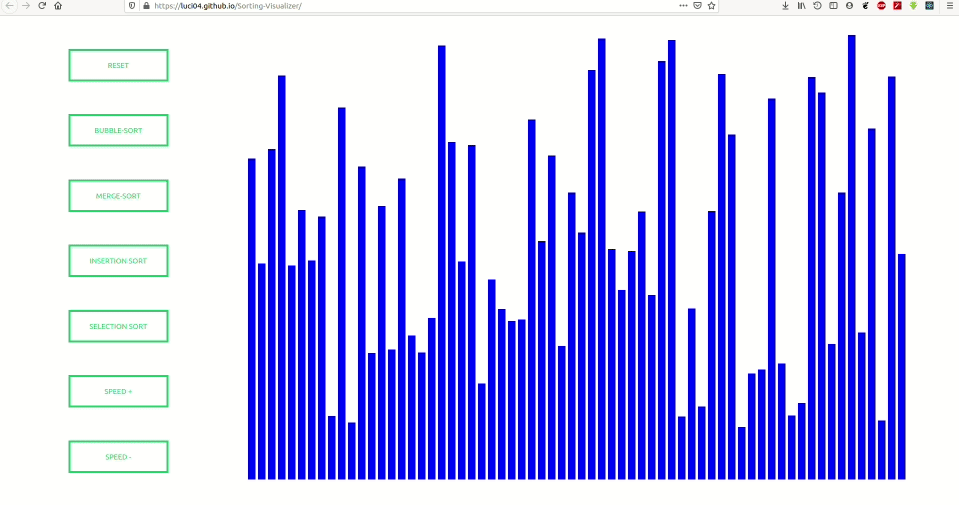

# Sorting Visualizer
React Based Application Where You Can see what happen Over an Array when a Sorting Algo. is Applied


# Features!
  - Random Function
  - 4 Different Algorithms
  - Drag and drop while creating



### Tech

* [React] 
* [Javascript] 
* [CSS] 
* [DOM]
* [react-sortable-hoc]


### Installation

Install the dependencies and devDependencies and start the server.

```sh
$ cd Sorting-Visualizer
$ npm install -d
$ npm start
```


